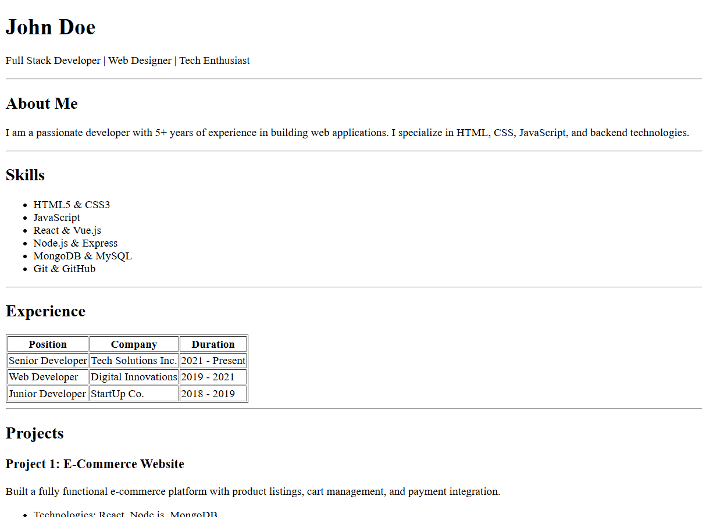
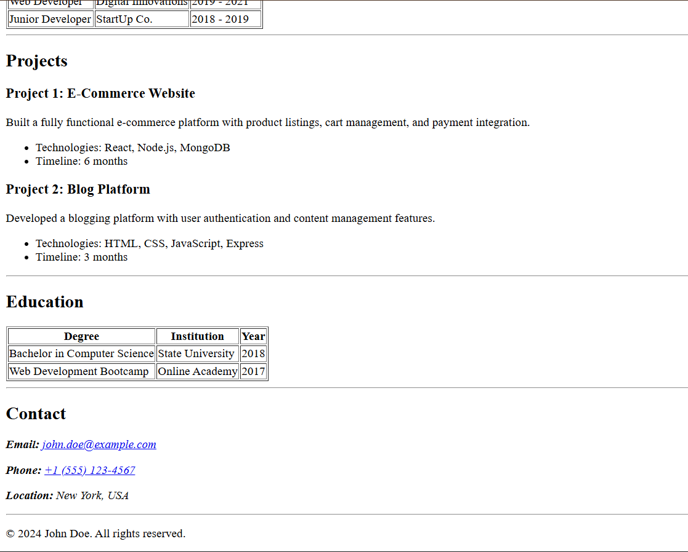

# HTML Resume Page Assignment

## Definition

This project is a single-page resume website built using only HTML.  
The goal of the assignment is to create a clean and structured resume layout using proper semantic HTML elements such as headings, sections, lists, and tables without using CSS.

The resume includes sections like:

- Header with name and role
- About section
- Skills list
- Experience table
- Projects section
- Education table
- Contact details

The focus of this assignment is correct HTML structure, readability, accessibility, and semantic markup.

## Screenshots

### Resume Screenshot




## Usage

1. Clone the repository:
   ```bash
   git clone <your-repository-link>
   ```

## Links

Live Here: https://anshmittal86.github.io/html-resume-page-assignment-webdev2.0/
